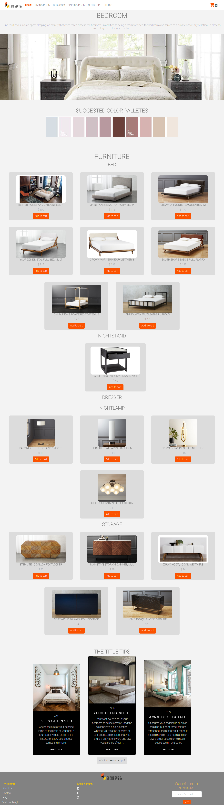
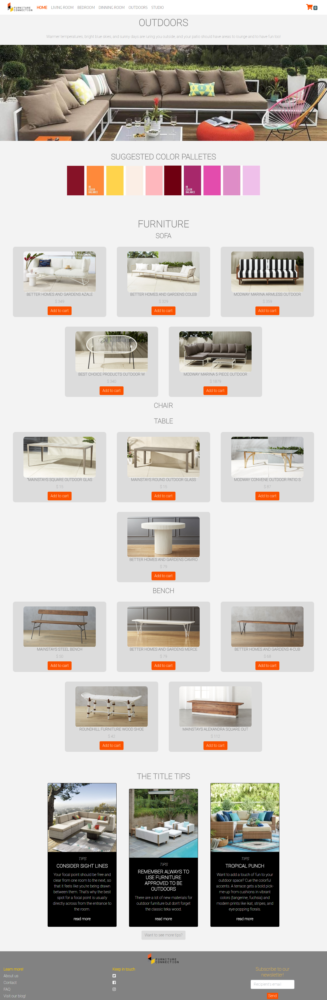
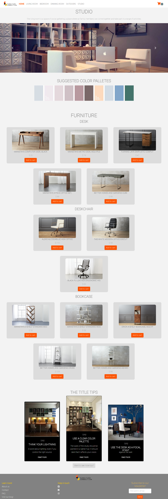
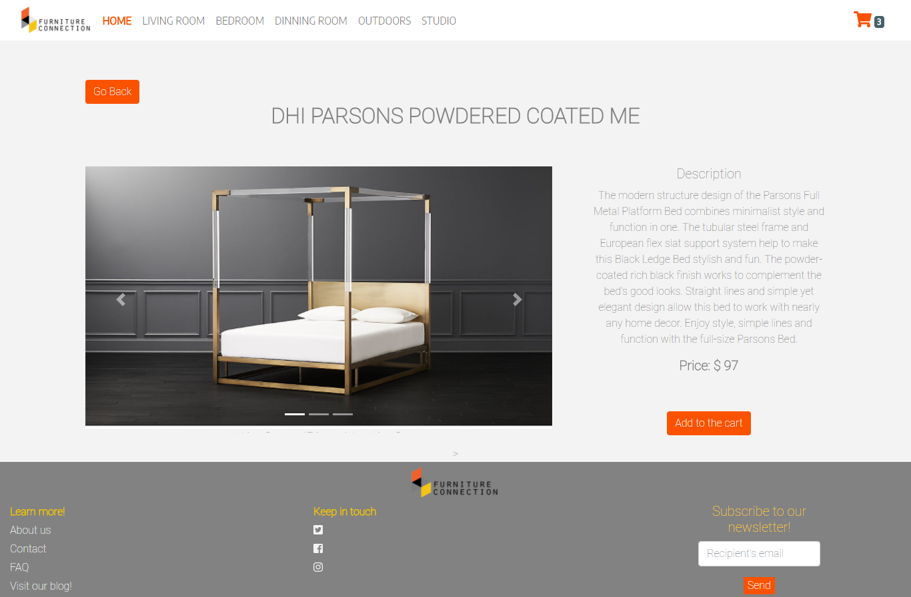
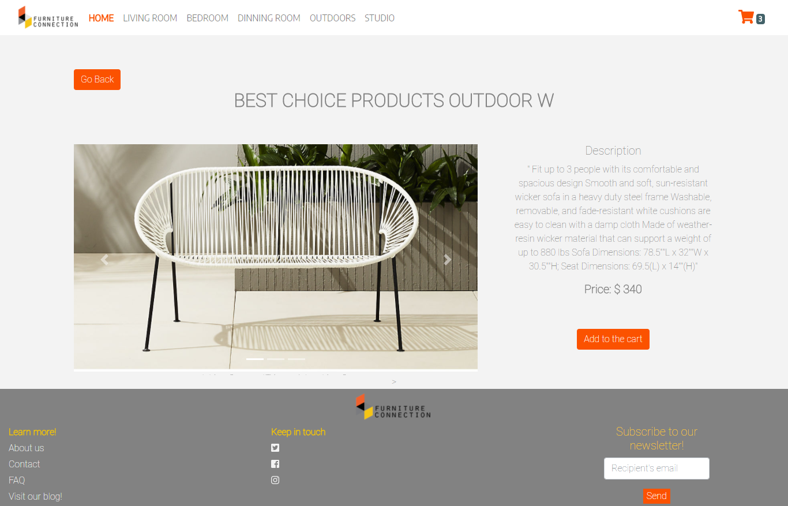

# Furniture Connection

## Descripción

Proyecto desarrollado para Laboratoria consistente en la creación de una SPA (Single Page Application) de un e-commerce obteniendo los productos mediante la API de Walmart, Paypal para método de pago y sincronizando imágenes con una base de datos local. Utilizamos bootstrap v4 para el maquetado. Javascript-vanilla y JQuery para la funcionabilidad y local-storage para almacenaje.

### Sobre Furniture Connection 

Furniture connection es un e-commerce que se dedica a la venta de muebles de diseñador. Aquello que lo diferencia de sus competidores es que no únicamente vende muebles, sino que ayuda a hacer la experiencia de decoración más fácil y placentera para sus clientes, otorgando consejos de decoración y también sugiriendo paletas de colores de acuerdo a cada habitación. Cuenta con cinco categorías de muebles: Living Room, Dinning Room, Bedroom, Outdors & Studio. 

## Vista previa 

### Vista de Home (Landing-page)

### Vista de Bedroom. 

### Vista de Outdoors. 

### Vista de Studio. 

### Muestra de vista de objeto seleccionado 1.

### Muestra de vista de objeto seleccionado 2.

### Vista de checkout

## Desarollada para [laboratoria] (www.laboratoria.la)
